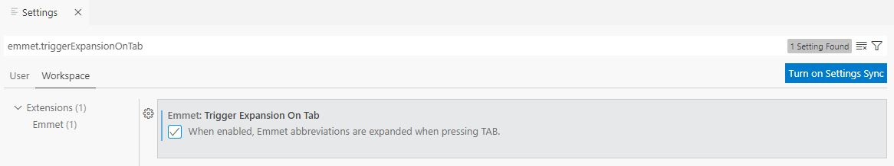
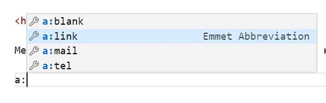

This is a summary of the free course by Ismail Useinov on stepik.org "Emmet layout simulator plugin". Emmet (formerly Zen Coding) is a set of text editor plugins to speed up writing HTML, CSS and Javascript code.  

[Emmet Official Website](https://emmet.io/)    
[Emmet Documentation](https://docs.emmet.io/)   
[Emmet Condensed Documentation](https://docs.emmet.io/cheat-sheet/)     
[Emmet Github Repository](https://github.com/emmetio/emmet)   

Free course in Russian can be viewed at the following link:        
[Тренажер по вёрстке плагин Emmet](https://stepik.org/course/113654/syllabus)  

**Thanks to Stepik.org and Ismail Useinov for free course**    

Course content
1. [Introduction](#1-introduction)   
+ [Installation of Emmett](#installation-of-emmett);    
+ [Elements](#elements);  
+ [Nesting operators](#nesting-operators);
+ [Attribute operators](#attribute-operators);
2. [Emmet for HTML](#2-emmet-for-html)    
+ [HTML abbreviations](#html-abbreviations);    
+ [Heading tags](#heading-tags);  
+ [Emmet Special Instructions](#emmet-special-instructions);  
+ [Working with Forms](#working-with-forms);  
+ [Frequently used tags](#frequently-used-tags);  
3. [Emmet for CSS](#3-emmet-for-css)        
+ [Formatting Padding Box Model](#formatting-padding-box-model);    
+ [Fonts Text Background Color](#fonts-text-background-color);  
+ [Content Table Borders List XSL](#content-table-borders-list-xsl);    
+ [BEM Filters Settings](#bem-filters-settings);  
4. [Lifehacks and tricks VS Code](#4-lifehacks-and-tricks-vs-code)    

# Emmet #     

## 1. Introduction ##

### Installation of Emmett ###    

In the VS Code Emmet is preinstalled!    
Create the basic structure of the HTML-page    
`! + tab`

```html
<!DOCTYPE html>
<html lang="en">
<head>
    <meta charset="UTF-8">
    <meta http-equiv="X-UA-Compatible" content="IE=edge">
    <meta name="viewport" content="width=device-width, initial-scale=1.0">
    <title>Document</title>
</head>
<body>
    
</body>
</html>
```    

If `!+tab` doesn't work in vs code for HTML    
check settings `emmet.triggerExpansionOnTab: true`    

    

P.S. instead of `! + tab` in vs code you can use `html:5 + tab`   
P.P.S. forced call prompt Emmet `ctrl + space`    

### Elements ###    

`div + tab` (элемент)    

```
<div></div>
```

### Nesting operators ###   

**Child: >** (дочерние элементы - "ребенок") ####    

`div>ul>li + tab`    

```
<div>
    <ul>
        <li></li>
    </ul>
</div>
```    

**Sibling: +** (соседние элементы - "брат")    

`header+main+aside+footer + tab`    

```
<header></header>
<main></main>
<aside></aside>
<footer></footer>
```    

**Climb-up: ^** (поместить выше - "карет")    

`header+div>main+aside^footer + tab`    

```
<header></header>
<div>
    <main></main>
    <aside></aside>
</div>
<footer></footer>
```    

**Multiplication: \*** (умножение)    

`ul>li*3 + tab` (несколько элементов)    

```    
<ul>
    <li></li>
    <li></li>
    <li></li>
</ul>
```    
 
`ul>li.item$*2 + tab` ($ задаёт номер в названии класса)    

```    
<ul>
    <li class="item1"></li>
    <li class="item2"></li>
</ul>
```    

`ul>li.item$$$*3 + tab` ($$$ задаёт трехзначный номер в названии класса)

```
<ul>
    <li class="item001"></li>
    <li class="item002"></li>
    <li class="item003"></li>
</ul>
```

`ul>li.item$@-*3 + tab` (@- задает обратный порядок номеров в названи класса)

```
<ul>
    <li class="item3"></li>
    <li class="item2"></li>
    <li class="item1"></li>
</ul>
```

`ul>li.item$@3*5 + tab` (@3 задает начальную цифру номеров в названи класса)

```
<ul>
    <li class="item3"></li>
    <li class="item4"></li>
    <li class="item5"></li>
    <li class="item6"></li>
    <li class="item7"></li>
</ul>
```

**Grouping: ()** (группировка)    

`div>(header>ul>li*2>a)+footer>p + tab`    

```
<div>
    <header>
        <ul>
            <li><a href=""></a></li>
            <li><a href=""></a></li>
        </ul>
    </header>
    <footer>
        <p></p>
    </footer>
</div>
```    

## Attribute operators ##   

**ID and CLASS** (классы и идентификаторы)    

`div.wrapper + tab` (через `.` добавляется класс)   

```
<div class="wrapper"></div>
```    

`div#wrapper + tab` (через `#` добавляется идентификатр)   

```
<div id="wrapper"></div>
```    

`div#wrapper.wrapper.container + tab` (комбинация с идентификатором и несколькими классами)   

```
<div id="wrapper" class="wrapper container"></div>
```    

`#wrapper.wrapper + tab` (тэг `div` можно опускать)   

```
<div id="wrapper" class="wrapper"></div>
```    

**Custom attributes** (пользовательские атрибуты)    

`button[type="button" disabled] + tab` (добавляются через `[]`)   

```
<button type="button" disabled></button>    
```    

`p>{Click }+a{here}+{ to continue} + tab` (через `{}` добавляется текст)   

```
<p>Click <a href="">here</a> to continue</p>
```    

**Auto tag substitution** (автоподстановка тегов)  

`.classname + tab` (Названия тегов можно не указывать при создании класса. В таком случае тег создастся максимально подходящий в определенной ситуации)   

```
<div class="classname"></div>
```    

`ul>.classname + tab`    

```
<ul>
    <li class="classname"></li>
</ul>
``` 

`table>.row>.col + tab`  

```
<table>
    <tr class="row">
        <td class="col"></td>
    </tr>
</table>
``` 

## 2. Emmet for HTML ##

### HTML abbreviations ###   

      

P.S. forced call prompt Emmet `ctrl + space`    

### Heading tags ###  


### Emmet Special Instructions ###  


### Working with Forms ###  


### Frequently used tags ###  


## 3. Emmet for CSS ##


### Formatting Padding Box Model ###  


### Fonts Text Background Color ###  


### Content Table Borders List XSL ###  


### BEM Filters Settings ###  


## 4. Lifehacks and tricks VS Code ##

**Dummy text** (текст-рыба)    

`lorem + tab` (30 word default dummy text )     
`lorem5 + tab` (5 word dummy text)     
`loremru + tab` (dummy text in Russian)    
`loremru10 + tab` (dummy text in Russian for 10 words)    

```
Далеко-далеко за словесными горами в стране гласных и согласных живут рыбные тексты.
``` 

**Copy line to line below** (копирование строки на строку ниже)    

cursor at the end of the line to be duplicated   
`Alt + Shift + ↓` (down arrow on keyboard)     

**Multicursor** (мультикурсор)    

`Alt + Cursor click`     
`Stuck Mouse Wheel + Cursor move`     


  